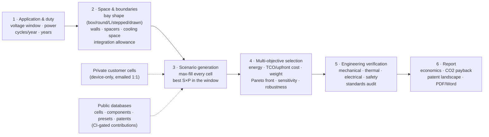

# battery-design

**Live app: <https://morshedvarzandeh.github.io/battery-design/>**

A 3D battery pack designer that runs entirely in the browser — a static page
with no build step and no server (deployed by GitHub Pages on every merge to
`main`; Three.js is vendored, so it also works offline).

Want to add a cell or component you found on the market? See
[CONTRIBUTING.md](CONTRIBUTING.md) — new entries integrate into the pickers,
optimizer, analysis and views automatically once they pass the CI data gate
(`tools/validate.mjs` + `tests/`).

Cell data is curated from public datasheets, several extracted via the
companion [battery-data](https://github.com/morshedvarzandeh/battery-data)
project's provenance-first datasheet pipeline.

## What it does

- **Design** — pick a cell (cylindrical 18650/21700/26650/32700/4680,
  prismatic LFP/LTO, NMC pouches, wearable LiPo pouches 401020/602030/802540,
  Na-ion), set series × parallel, choose grid
  or staggered-hex packing for cylinders and stacking for prismatic/pouch,
  and adjust cell spacers, wall thickness and busbar headroom. The 3D view
  colors cells by series group (following the actual serpentine welding
  order) or chemistry, shows the enclosure and series current path, and
  explodes for inspection.
- **From usage** — start from an application preset (e-bike, drone, ESS, EV,
  power tool, …) or raw requirements (voltage window, energy, continuous and
  peak power, charge rate, mass/size limits, temperature, cycle-life target).
  The optimizer enumerates cell × S × P candidates, sizes P by the binding
  constraint, checks feasibility, and ranks the survivors with reasons and
  warnings.
- **Fit box** — enumerate arrangements, orientations and layer counts to
  pack the current configuration into a target envelope, or just minimize
  volume.
- **Parts** — market-representative component catalogs per cell shape:
  busbars/interconnects (nickel strip, laser-welded copper, stamped aluminium,
  Tesla-style wire bonds, cell contact systems), cell spacers and holders
  (incl. aerogel/mica propagation barriers and pouch compression foam), gas
  vents (cell burst discs, PTFE breathers, PRVs, rupture panels), cooling
  systems (forced air, side and bottom cold plates, Tesla-style between-cell
  ribbon, immersion, PCM), thermal interface materials, and housings — each
  with class-typical properties and example suppliers (representative, not
  endorsements).
- **Analysis — four perspectives** — every design is audited from the
  Mechanical (component mass budget, compression, vibration, IP fit),
  Thermal (I²R heat, cooling adequacy ΔT, TIM interface), Electrical
  (busbar ampacity and loss, creepage/clearance per IEC 60664-1, isolation
  and leakage) and Safety (venting, propagation barriers, flammability, plus
  the full standards audit: UN 38.3 / IATA, ECE R100 / ISO 6469-3,
  IEC 62619 / 62133-2, UL family) perspectives, with the actual numbers in
  every finding.
- **Architecture** — how the pack is built up and switched: the module
  hierarchy (divisor enumeration of S, with cell-to-pack as a first-class
  path and parallel racks for MWh-scale systems — the tool models one pack
  and says how many you need), BMS topology (centralized / master-slave
  daisy chain / wireless, AFE IC and sense-wire counts, temperature-sensor
  ratio exposed), precharge sizing (τ = RC, ½CV², the main− → precharge →
  main+ closing sequence), contactors and fuse rules of thumb, DC-DC
  auxiliary supply, and the isolation floor with the governing standard as
  an explicit choice (the sources conflict at 500 vs 100 Ω/V — never
  averaged). Rendered as a one-line diagram (the BMS graphic follows the
  chosen topology) that also embeds in the report. The architecture also
  names the communication bus each application expects (SAE J1939 for heavy
  trucks and lift trucks, CAN/CAN FD + UDS for automotive, CANopen for
  AGVs, Modbus/SunSpec for stationary storage, NMEA 2000 marine) and the
  cell-joining process per format (resistance spot for cylindrical cans,
  laser for prismatic terminals, ultrasonic for pouch tab stacks — per the
  ASME MSEC2010-34168 joining review), and its findings are folded into the
  Electrical audit pane rather than kept in a silo.
- **Environment & seasons** — the system temperature is not one number:
  climate presets (temperate / cold / hot / indoor) carry per-season ambient
  bands, fill the design temperature window (design case = all year), and a
  season view shows the estimated system temperature (ambient high + the
  pack's own heat rise) with heater/charge-inhibit and cooling-margin flags.
- **Rules tab** — the market release checklist: standards per application
  class × target market (EU / US / China / International), always including
  UN 38.3 transport, with chemistry-market gates such as China's e-bus
  practice that effectively excludes ternary (NMC/NCA) chemistry from urban
  buses (flagged as a blocker with "verify the current MIIT catalogue").
  Plus the Regulation (EU) 2023/1542 staged timeline (carbon declarations,
  battery passport with LIVE SoH over UDS, recycled-content minimums,
  recovery targets vs recycling efficiency kept strictly apart) and "what
  applies to THIS design" checks. Guidance, not legal advice.
- **Application integration** — selecting an application shapes everything
  and omits what does not apply: the standards reference list filters to
  the application class (a vacuum robot never advertises ECE R100; UN 38.3
  transport always stays), low-voltage packs drop the HV precharge chain
  for a solid-state disconnect, indoor machines auto-select the indoor
  climate, and off-preference chemistries are visibly chipped on max-fill
  cards. A dedicated CI suite (`tests/integration-regressions.mjs`) walks
  every application × every module and FAILS when a new preset or standard
  is added unclassified — coherence is enforced, not hoped for.
- **BMS in two layers** — the system diagram shows the topology in context,
  and a second "Inside the BMS" view shows the master's real contents (MCU,
  comm interface, isolated supply, drivers, current sense, isolation
  monitor) and every slave AFE IC with its links per topology. The module
  series size (S_mod) is selectable from the divisors of S, so a
  mechanically-fixed 30S module at 16-channel AFEs correctly carries TWO
  slave ICs — the electronics adapt to the mechanics, never the reverse.
  Both diagrams (and the thermal loop) open at reading size on a tap.
- **The full control hierarchy** — cell → module (slave AFE) → BMS master →
  **supervisory layer**: the machine above the BMS is named per application
  (EMS for storage, VCU/ECU for vehicles, PMS for vessels, fleet controller
  for AGVs, host SoC for gadgets) in the diagrams, the panel and the
  report; the integration suite requires an explicit supervisor for every
  application.
- **Thermal management system tab** — the SYSTEM behind the cold plate: the
  loop (pump, radiator, refrigerant chiller / heat exchanger, valves,
  heater branch for winter charging) selected by heat load, climate and
  the chosen cooling hardware (override first-class, like BMS topology);
  first-order coolant flow from ṁ = Q/(c_p·ΔT); the chiller's compressor
  cost charged honestly to the HIGHER system (vehicle AC / plant HVAC that
  owns the refrigerant side); and the **BTMS ECU** as the third control
  unit — the BMS protects, the BTMS moves heat, the supervisor decides.
- **Interactive training** — a 🎓 walkthrough that drives the real UI, in
  two tracks: Simple (the five clicks a customer needs) and Advanced (duty
  & DoD economics, seasons, stacks, multi-objective weights, architecture,
  release rules, sensitivity). Inline "why these spaces exist" guidance
  explains cell spacing (swelling design allowance + propagation break),
  wall thickness (the crash/crush TESTS — ECE R100 Annex 4, GB 38031,
  UL 2580 — prescribe outcomes, not millimetres) and vent-path headroom.
- **Closest-possible framing** — when a target is out of reach in the given
  space, the tool never answers "infeasible": it presents the most possible
  solution close to the need, states the shortfall, and says how many
  bays/racks of the design would cover the target.

## The system workflow

The tool follows the same order a pack project runs in the market: the
customer's application and boundaries come first, and the design is derived
from them — never the other way around. The workflow bar in the app shows
where you are at every step.

## Space-first design, validated against real cars

The Fit tab works the way real projects do: the application fixes the
available space, and the tool extracts the most from it. The bay does not
have to be a rectangle — calculator-simple templates (box, round, L-shape,
stepped two-height) take typed dimensions, and a **Draw** mode lets you
sketch any plan outline on a 50 mm grid. The packer fills the true shape,
subtracting walls, spacer gaps, busbar headroom and the space the selected
cooling system consumes, then treats cell choice as a multi-objective
optimization (energy in the space vs cost vs mass, adjustable weights,
Pareto front flagged).

The model is benchmarked against production packs
(`tools/validate-vs-market.mjs`, runs in CI): with the calibrated 35%
integration allowance it reconstructs the Tesla Model 3 LR pack to within
1% (predicted 100S45P / 4,500 cells / 78.8 kWh vs the real 96S46P /
4,416 / 78.1 kWh), and shows the blade-cell cell-to-pack effect (96% of
geometric ideal vs ~64% for module-based packs).

## 2D-first workflow

The default working view is a cheap, dimensioned 2D drawing — top view (X·Y)
with cell layout, pitch/gap and outer dimensions, plus a side elevation (Z)
with layers and headroom. It redraws once per change with no WebGL and no
animation loop, so iteration is instant even for hundred-cell packs. The 3D
view is a **final render**: it is only instantiated when you press
"3D render", and its render loop pauses whenever you switch back to 2D.

## Honesty rules

- Provenance is two fields, not one flag. `basis` says where the electrical
  core came from — `contrib` (a contribution in the companion battery-data
  repo, named by `contribUid`), `external_datasheet`, `teardown`,
  `trade_press`, `composite` or `recalled` — and `inferredFields` lists what
  was worked out rather than read. A cell can be sourced and still have
  inferred dimensions; one flag could not say that, and it read the two apart:
  cells with no document anywhere looked datasheet-grade while the
  best-evidenced records here looked like estimates.
- Fitting a cell into a bay is an EXACT test, not a sampled one. Corner and
  midpoint sampling passes a cell that a wall runs straight through when the
  wall falls between the probes; the packer placed such cells before this was
  fixed. Rectangles test corner containment plus wall-edge intersection,
  circles test distance to every edge.
- The comparison radar scores each axis against a FIXED market range, not
  against the cells on screen. Set-relative scaling puts one cell on the rim
  and the other at the centre whatever the values are, which can say "these
  differ" but never "both are good". And an unpublished figure is skipped with
  a dashed span, never plotted at zero — several cells have no cycle-life
  number, and drawing them at the centre would be indistinguishable from a
  cell measured at zero cycles.
- Power is sized at the MINIMUM pack voltage. A constant-power load draws its
  highest current at the bottom of the discharge, so sizing at nominal
  under-sizes by vNom/vMin — about 1.44x for NMC.
- Pack mass adds 8% for interconnects plus an aluminium-wall estimate, and
  the UI says so. DCIR is cells-only (interconnects excluded), labeled.
- Standards output is engineering guidance derived from public standards —
  not certification, and the page repeats that disclaimer.
- Hex (staggered) packing is only offered where it is geometrically real:
  upright cylinders. Lying cylinders and prismatic cells pack rectangularly.

## Reading

Background reading on cell and pack design that informed the engineering
choices here. Cited as sources to read, not reproduced — nothing from these
is copied into the repository.

| Source | Useful for |
|---|---|
| [Battery Design](https://batterydesign.net/) | Working reference on cell formats, pack architecture, thermal and electrical design; broad and practical |
| [battery-data](https://github.com/Morshedvarzandeh/battery-data) | The companion repo: extracted datasheet facts with conditions, page numbers and quotes. `basis: 'contrib'` records here point into it |

## Architecture

| File | Role |
|---|---|
| `js/cells.js` | Cell library + chemistry data (self-contained, no imports) |
| `js/cell-picker.js` | Filter the cell field, then compare survivors as the pack being designed |
| `js/radar.js` | Seven-axis comparison radar, scored against fixed market ranges |
| `js/presets.js` | Application usage presets |
| `js/standards.js` | Standards rule engine over a computed design context |
| `js/components.js` | Component & materials catalog with supplier examples |
| `js/engineering.js` | Four-perspective analysis (mech/thermal/elec/safety) |
| `js/pack-engine.js` | Pure electrical + layout math (Z-up, mm) |
| `js/optimizer.js` | Requirement search + space fitting |
| `js/architecture.js` | Module partition, BMS topology, precharge/contactors/fuse/isolation, comms, welding |
| `js/seasons.js` | Climate/season ambient bands + per-season system-temperature outlook |
| `js/eurules.js` | EU Battery Regulation 2023/1542 timeline + applicability checks |
| `js/markets.js` | Release checklist per application class × market + chemistry-market gates |
| `js/btms.js` | Thermal management system: loop selection, flow sizing, BTMS control |
| `js/training.js` | Interactive walkthrough tracks (simple / advanced) |
| `js/viewer2d.js` | Default dimensioned 2D layout view (canvas, no WebGL) |
| `js/viewer3d.js` | Three.js instanced rendering — on-demand final render |
| `js/app.js` | UI state and wiring |

The data modules are import-free so they can be consumed by tooling (node
scripts, tests) without a browser.
