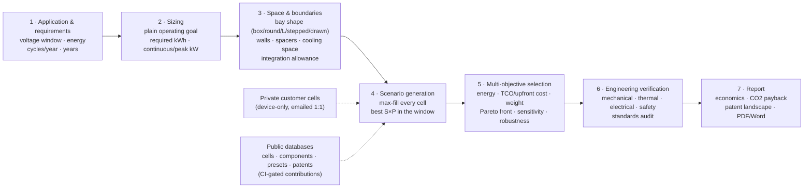

# battery-design


## Downloads

No installer release has been published yet. When the first tag passes the
full hosted browser, Godot and installed-package gates, its draft release can
be published with these validated Linux artifacts:

| You are on | File |
|---|---|
| Linux, Debian/Ubuntu | `.deb` |
| Linux, anything else | `.AppImage` |

Windows and macOS builds are not published yet. An installer nobody has
launched is not a release, and Linux is the platform this project can install
and run before publishing. Both other platforms run the designer in a browser
today, or from a clone with `node desktop/bd.mjs serve`.

**[→ Releases](https://github.com/Morshedvarzandeh/battery-design/releases)**

The runtime is bundled in those packages, so there is no "install Node first"
step. No account, no network, nothing uploaded.

Prefer not to install anything? The same designer runs in a browser at
**[morshedvarzandeh.github.io/battery-design](https://morshedvarzandeh.github.io/battery-design/)**,
with the advanced local model and export tools reserved for the desktop build.

Already have a simulation toolchain? The gated release workflow produces
`battery-design-ev.fmu`, a compiled FMI 2.0 Co-Simulation FMU containing
verified `linux64` (glibc 2.17+ baseline) and `win64` x64 binaries. Import the
`.fmu` directly; it is already a ZIP-format FMU archive. CI validates its FMI
2.0.5 XML contract,
native ABI and lifecycle, then imports and steps it with fmusim and FMPy on the
matching operating systems. These open-source checks do not certify acceptance
in ANSYS Twin Builder, Simulink or GT-SUITE; record a product/version-specific
result using the generated [enterprise signal/port map](docs/FMI_SIGNAL_MAP.md)
and [commercial acceptance checklist](docs/FMI_COMMERCIAL_ACCEPTANCE.md)
before making a host-support claim.

The desktop GUI and local API, plus the source/staged Node runner CLI, continue
to export an editable source-FMU build kit. That local source kit is not
loadable until it is compiled and packaged.

The Linux desktop packages are unsigned, so a software centre may warn about
them. Windows and macOS desktop packages are not currently built or advertised.

### Where each capability is exposed

| Surface | Available now |
|---|---|
| Browser GUI | Pack/application design, reports, Level-1 mission simulation, Rust/Wasm equation studio, SIL, comparative runaway/vent studies and HIL contract preparation |
| Desktop GUI extras | Advanced electro-thermal run, source-FMU kit export and the host-machine silhouette; no calibration button is shipped |
| Source/staged runner CLI | Governed trace import/manual calibration, governed staged ECM tuning, bounded multicore search and sweeps, BOM/wiring, grounding, LCA, swap/runaway studies and source-FMU export |
| Local API | Pack design and ontology, advanced simulation, canonical-dataset manual calibration and staged ECM tuning, bounded search, and source-FMU export |
| MCP | Pack design, mission/cell comparisons, ontology queries, known-issue diagnosis and engineering review; no calibration tool is shipped, and no ECM-tuning tool is shipped |
| Planned—not shipped | Crush, vibration, spatial thermal/corrosion solvers and a deterministic HIL target runtime |

The `.deb` and AppImage currently expose the desktop GUI and its authenticated
local API. They bundle Node as an internal sidecar but do not install a stable
customer-facing calibration shell command or a stable customer-facing
ECM-tuning shell command. Run the CLI from a clone with
`node desktop/bd.mjs …`, or from an explicitly staged runner tree; do not treat
the internal `bd-runner` sidecar as an installed CLI contract.

Resolved engineering failures are kept in a versioned
[root-cause quality memory](docs/ROOT_CAUSE_LIBRARY.md). The same immutable
catalog is importable in browser/JavaScript code, searchable from the desktop
CLI, and used by the MCP `diagnose_known_issue` assistant. Similarity matches
are retrieval hints, not proof of a diagnosis. Standard design reports do not
silently diagnose incidents; records expose explicit local references that a
reviewer can cite.

The local HTTP API binds only to `127.0.0.1`, requires a cryptographically
generated per-launch token and applies request/work limits. The command
`node desktop/bd.mjs serve` prints the private tokenised URL to open; the installed app handles this
automatically.

**Design a battery pack from an application and an available space — geometry,
electrical architecture, thermal system, mission simulation and the customer
report — entirely in your browser.**

[](LICENSE)
[](https://github.com/Morshedvarzandeh/battery-design/actions/workflows/ci.yml)
[](REFERENCES.md)

**Live app: <https://morshedvarzandeh.github.io/battery-design/>**

A 3D battery pack designer that runs entirely in the browser — a static page
with no build step and no server (deployed by GitHub Pages on every merge to
`main`; Three.js is vendored, so it also works offline).

Cars, vessels, robots and other host visuals live in a separate versioned
[`assets3d` library](docs/3D_ASSET_LIBRARY.md). The original low-poly assets
are independently MIT-licensed; the renderer contains no application-specific
vehicle geometry.

Every rule, threshold and default is traceable to a public datasheet or a named
standard — and the assumptions that have **no** public source are listed openly
in [REFERENCES.md §8](REFERENCES.md#8-assumptions-with-no-public-source).

Want to add a cell or component you found on the market? See
[CONTRIBUTING.md](CONTRIBUTING.md) — new entries integrate into the pickers,
optimizer, analysis and views automatically once they pass the CI data gate
(`tools/validate.mjs` + `tests/`).

Cell data is curated from public datasheets, several extracted via the
companion [battery-data](https://github.com/morshedvarzandeh/battery-data)
project's provenance-first datasheet pipeline.

## What it does

- **Design** — pick a cell (cylindrical 18650/21700/26650/32700/4680,
  prismatic LFP/LTO, NMC pouches, wearable LiPo pouches 401020/602030/802540,
  Na-ion), set series × parallel, choose grid
  or staggered-hex packing for cylinders and stacking for prismatic/pouch,
  and adjust cell spacers, wall thickness and busbar headroom. The 3D view
  colors cells by series group (following the actual serpentine welding
  order) or chemistry, shows the enclosure and series current path, and
  explodes for inspection.
- **From usage** — start from an application preset (e-bike, drone, ESS, EV,
  power tool, …) or raw requirements (voltage window, energy, continuous and
  peak power, charge rate, mass/size limits, temperature, cycle-life target).
  The optimizer enumerates cell × S × P candidates, sizes P by the binding
  constraint, checks feasibility, and ranks the survivors with reasons and
  warnings.
- **Fit box** — enumerate arrangements, orientations and layer counts to
  pack the current configuration into a target envelope, or just minimize
  volume.
- **Parts** — market-representative component catalogs per cell shape:
  busbars/interconnects (nickel strip, laser-welded copper, stamped aluminium,
  Tesla-style wire bonds, cell contact systems), cell spacers and holders
  (incl. aerogel/mica propagation barriers and pouch compression foam), gas
  vents (cell burst discs, PTFE breathers, PRVs, rupture panels), cooling
  systems (forced air, side and bottom cold plates, Tesla-style between-cell
  ribbon, immersion, PCM), thermal interface materials, and housings — each
  with class-typical properties and example suppliers (representative, not
  endorsements).
- **Analysis — four perspectives** — every design is audited from the
  Mechanical (component mass budget, compression, vibration, IP fit),
  Thermal (I²R heat, cooling adequacy ΔT, TIM interface), Electrical
  (busbar ampacity and loss, creepage/clearance per IEC 60664-1, isolation
  and leakage) and Safety (venting, propagation barriers, flammability, plus
  the full standards audit: UN 38.3 / IATA, ECE R100 / ISO 6469-3,
  IEC 62619 / 62133-2, UL family) perspectives, with the actual numbers in
  every finding.
- **Architecture** — how the pack is built up and switched: the module
  hierarchy (divisor enumeration of S, with cell-to-pack as a first-class
  path and parallel racks for MWh-scale systems — the tool models one pack
  and says how many you need), BMS topology (centralized / master-slave
  daisy chain / wireless, AFE IC and sense-wire counts, temperature-sensor
  ratio exposed), precharge sizing (τ = RC, ½CV², the main− → precharge →
  main+ closing sequence), contactors and fuse rules of thumb, DC-DC
  auxiliary supply, and a topology-aware UN R100 isolation resolver (separate
  DC, separate AC, connected AC/DC and the evidence-gated protected case —
  never averaged or transferred to marine IT systems). Rendered as a one-line diagram (the BMS graphic follows the
  chosen topology) that also embeds in the report. The architecture also
  names the communication bus each application expects (SAE J1939 for heavy
  trucks and lift trucks, CAN/CAN FD + UDS for automotive, CANopen for
  AGVs, Modbus/SunSpec for stationary storage, NMEA 2000 marine) and the
  cell-joining process per format (resistance spot for cylindrical cans,
  laser for prismatic terminals, ultrasonic for pouch tab stacks — per the
  ASME MSEC2010-34168 joining review), and its findings are folded into the
  Electrical audit pane rather than kept in a silo.
- **HV startup, shunt and fast protection** — a separate electrical package
  calculates the precharge resistor from the DC-link target, simulates the
  voltage/current/power trace and resistance-tolerance corners, screens the
  precharge contactor, and checks supplier pulse, repetition and switching
  evidence. The shunt calculator shows voltage burden, I²R loss, measurement
  error and installed-termination temperature over the stated duty. Its
  threshold is then replayed against the R–L short-circuit trace to expose
  detection time, interruption current and loop magnetic energy. Sensata's
  SFP200MOD cases remain explicitly archived examples—not selectable release
  hardware—and every production choice requires a current part/revision/date.
- **Environment & seasons** — the system temperature is not one number:
  climate presets (temperate / cold / hot / indoor) carry per-season ambient
  bands, fill the design temperature window (design case = all year), and a
  season view shows the estimated system temperature (ambient high + the
  pack's own heat rise) with heater/charge-inhibit and cooling-margin flags.
- **Rules tab** — the market release checklist: standards per application
  class × target market (EU / US / China / International), always including
  UN 38.3 transport, with chemistry-market gates such as the declared China
  urban-e-bus catalogue screen for ternary (NMC/NCA) chemistry. This is
  labelled as catalogue practice—not a universal statutory chemistry ban—and
  requires verification against the current MIIT catalogue.
  Plus the Regulation (EU) 2023/1542 staged timeline (carbon declarations,
  battery passport with accessible current SoH data through a documented
  interface—UDS is one option, not a mandated protocol—recycled-content minimums,
  recovery targets vs recycling efficiency kept strictly apart) and "what
  applies to THIS design" checks. Guidance, not legal advice.
- **Application integration** — selecting an application shapes everything
  and omits what does not apply: the standards reference list filters to
  the application class (a vacuum robot never advertises ECE R100; UN 38.3
  transport always stays), low-voltage packs drop the HV precharge chain
  for a solid-state disconnect, indoor machines auto-select the indoor
  climate, and off-preference chemistries are visibly chipped on max-fill
  cards. A dedicated CI suite (`tests/integration.test.mjs`) walks
  every application × every module and FAILS when a new preset or standard
  is added unclassified — coherence is enforced, not hoped for.
- **BMS in two layers** — the system diagram shows the topology in context,
  and a second "Inside the BMS" view shows the master's real contents (MCU,
  comm interface, isolated supply, drivers, current sense, isolation
  monitor) and every slave AFE IC with its links per topology. The module
  series size (S_mod) is selectable from the divisors of S, so a
  mechanically-fixed 30S module at 16-channel AFEs correctly carries TWO
  slave ICs — the electronics adapt to the mechanics, never the reverse.
  Both diagrams (and the thermal loop) open at reading size on a tap.
- **The full control hierarchy** — cell → module (slave AFE) → BMS master →
  **supervisory layer**: the machine above the BMS is named per application
  (EMS for storage, VCU/ECU for vehicles, PMS for vessels, fleet controller
  for AGVs, host SoC for gadgets) with its functions and interfaces in the
  diagrams, the panel and the report; the integration suite requires an
  explicit supervisor for every application. Where the supervisor is a real
  **EMS**, its architecture is chosen from the literature families —
  centralized / hierarchical (three control levels, IEEE 2030.7 framing) /
  distributed (droop/price signals) — auto-suggested from the stack count,
  overridable, and the question never appears for applications without an
  EMS.
- **Thermal management system tab** — the SYSTEM behind the cold plate: the
  loop (pump, radiator, refrigerant chiller / heat exchanger, valves,
  heater branch for winter charging) selected by heat load, climate and
  the chosen cooling hardware (override first-class, like BMS topology);
  first-order coolant flow from ṁ = Q/(c_p·ΔT); the chiller's compressor
  cost charged honestly to the HIGHER system (vehicle AC / plant HVAC that
  owns the refrigerant side); and the **BTMS ECU** as the third control
  unit — the BMS protects, the BTMS moves heat, the supervisor decides.
- **Sensors tab** — the sensor plan by level: cell (voltage sense taps —
  carried by the CCS foil when a cell contact system is selected, discrete
  harness otherwise; NTC budget with 1:3 shown only as an assumption-labelled
  observability benchmark), module
  (slave AFEs, per-module minimum), system (pack current, pack voltage on
  BOTH sides of the contactors for weld detection, isolation monitor and
  HVIL above 60 V, thermal-runaway/vent-gas detection where scale and
  chemistry warrant it), and the cooling loop (coolant in/out, flow, level,
  refrigerant P/T at the chiller, heater guard) read by the BTMS. Omission
  is the feature: a wearable lists no coolant sensors, a drone no runaway
  detector — absent groups are genuinely absent. Ram-air applications
  (drones, e-bikes) are recognized: real heat, free airflow, no fans, no
  BTMS, nothing to instrument.
- **Choices carry their consequences** — every architecture selection (BMS
  topology, EMS architecture, thermal loop) shows explicit pros and cons AT
  the selector, and is judged against the actual design with a verdict:
  suggested / workable with the costs listed / **not workable here** — the
  last reserved for physics- or source-backed limits (a >62-node daisy
  chain as one string, a radiator loop that must cool below ambient,
  passive air under kilowatt heat), each stated with the reason and the
  fix. Verdicts fold into the Electrical/Thermal audit panes, the pass/fail
  badge and the report.
- **A knowledge graph decides who sees what** — `js/knowledge.js` holds the
  concept nodes (stacks & racks, EMS architecture, thermal loop, HV chain…)
  and the edges from each application class to the concepts it actually
  needs. Every surface traces its visibility to an edge in this graph
  instead of scattered ifs: a wearable customer's training never mentions
  rack stacks or EMS dispatch (the steps are omitted and renumbered), and
  the Components tab folds whole classes away with the reason. Who needs
  what is inspectable and tested, not implied.
- **Components in classes** — the Components tab is organized in collapsible
  levels: Electrical (busbar + the architecture-derived contactors,
  precharge resistor, fuse, DC-DC, comm bus), Thermal (cooling + TIM),
  Control (BMS / BTMS / supervisor / EMS — designed, not picked), Safety
  (venting + isolation + the standards gate) and Mechanical (spacer,
  housing). Classes an application does not need are collapsed and labelled
  "not needed", not shown every time.
- **Symbols that look like the part** — the thermal loop is drawn in
  P&ID-style symbols (a pump is a circle with an impeller triangle, a
  3-way valve a bowtie, the radiator has fins, the chiller its plate-HX
  zigzag, the heater its element) and the HV chain uses IEC-style fuse and
  contactor-switch glyphs — not one more rigid box.
- **Three report views** — alongside the customer PDF/Word report, a LAYERED
  architecture report downloads as a standalone HTML file: the reader
  selects a layer (system → pack → module → cell, control hierarchy,
  thermal system, sensor plan) and opens exactly the level they care
  about, diagrams embedded. The animated visual decision report is also a
  self-contained HTML file: in under a minute it presents the selected host,
  nominal sizing, available mission simulation, the actual selected thermal
  hardware, findings and the semantic checksum. It projects the same report
  snapshot and never runs a second calculation or invents a before/after case.
  An [audited 52-second encoded example](reports/examples/visual-decision-report/README.md)
  is kept with its calculation data, media digest and full visual attribution.
- **The engineer's workbook (Excel)** — an export engineers can argue with:
  a SpreadsheetML workbook whose computed cells carry LIVE formulas over
  named inputs (`=CellPrice*SCount*PCount`, `=CEILING(CyclesYr*Years/
  CycleLife,1)`…). Change a yellow input and the TCO, CO₂ and coolant-flow
  chains recompute in Excel/LibreOffice; a "Your value" column and the
  Feedback sheet invite corrections back by email — the feedback loop that
  teaches the tool.
- **One simple Sizing step, three internal paths** — the customer answers
  “What should the battery do?” and sees required energy, continuous power
  and peak power. The knowledge graph decides whether the relevant cards are
  a raw duty, an EMS/PMS operating policy, or Eco/Normal/Sport. Grid storage
  includes solar self-consumption, peak shaving and load shifting; marine
  includes full electric, load levelling, boost, spinning reserve, peak
  shaving, load smoothing and ramp support. The generated battery trace and
  measured CSV tools stay under Engineering details.
- **Stable software surface** — `designFromSpec` and MCP keep the existing
  `profileId` input and add an explicit `policyId`. Responses record the
  resolved sizing decision, generated profile, source demand and driving
  mode so software teams can automate the same engine without screen logic.
- **Bus service inputs** — e-bus sizing includes empty, typical and full
  passenger-load cases plus the standard stop–go cycle or a locally processed
  GPX route. Route distance, speed, stops, elevation and passenger/cargo mass
  feed the existing road-physics model; API/MCP clients can pass route points
  and payload directly.
- **Mission simulation (level 1)** — the Sim tab runs the design through
  TIME: the application's load profile drives an equivalent-circuit model
  of the pack (chemistry-class OCV(SoC) − I·R, coulomb counting) coupled to
  a lumped thermal model (I²R in, the selected cooling's conductance out).
  Traces for power, SoC, voltage sag and temperature; repeat passes, start
  below full, or switch to the winter/summer ambient of the chosen climate.
  Violations are findings like everything else: pack runs EMPTY at 1.2 h,
  voltage cutoff under peak (power-limited, not energy-limited), the
  temperature rating crossed, winter charge inhibited without a heater
  branch, regen lost against a full battery. Assumptions stated in the
  pane and the report — class-typical OCV shapes, constant DCIR, one
  lumped mass; deliberately level 1 (electrode-level P2D needs parameters
  manufacturers do not publish). Tick two or more cells in the cell picker
  and the IDENTICAL mission runs for each as the equivalent pack for the
  same job (S from the design's voltage window, P from its energy target) —
  outcome, cost and $/kWh-delivered side by side in the Sim tab and as a
  comparison table in the report, so the value of different cells is weighed
  on results, not datasheets.
- **The AC side, without the confusion** — a Charging panel that answers a
  customer's question in one sentence: *how does this machine charge, and
  how long does it take* (20→80% and full, CC-CV tail included). The
  charging ARCHITECTURE follows the application instead of bolting an
  on-board charger onto everything: a real OBC for vehicles and RVs, "the
  charger is an external brick" for e-bikes and tools, "the PCS IS the AC
  side" for storage, a dock for robots, the host device for wearables.
  Everything deeper — OBC power classes (3.6/7.4/11/22 kW), the AC
  connector and charge comms per target market (Type 2 / J1772·NACS /
  GB/T), the named bottleneck (charger vs pack), and the charging strategy
  with its pros and cons — lives behind a collapsed *expert* fold. Depot
  vs opportunity charging is treated as the pack-SIZING decision it is,
  and the mission simulation now takes charge segments: top-ups after
  every pass or one charge at base, powered by the cell's own datasheet
  charge rating — so an e-bus route with pantograph top-ups is a scenario
  you can actually run, winter charge-inhibit included.
- **A parameterised model with a governed calibration path** — the browser simulation
  answers "does this pack survive the duty?" with one resistance and one
  thermal mass, which is honest for a first look and useless for a decision.
  The desktop model (`js/sim2.js`) is built the other way round: **every
  coefficient is a named, bounded, documented parameter you can change.** It adds
  RC dynamics with Arrhenius temperature dependence, the reversible entropic
  heat term (which cools on charge and warms on discharge — the term whose
  absence embarrasses I²R-only models against real data), a per-module thermal
  network with an ε-NTU coolant stream (a stopped pump removes no heat; a fast
  one is limited by the cold plate), and calendar + cycle aging as a
  year-by-year capacity and resistance schedule. The source-runner CLI/local-API `calibrate`
  workflow consumes a closed, checksummed
  [`battery-design/calibration-dataset@1`](docs/SYNTHETIC_CALIBRATION.md)
  snapshot and reports how far each allowlisted parameter moved, whether it hit
  a bound, the exact optimizer work and the preprocessing applied. Delimited or
  columnar-JSON exports first pass through an exact mapping of columns, units,
  current sign and physical signal locations; malformed rows are rejected, not
  dropped. The synthetic recovery test generates observations with the same
  battery-design equations and checks optimizer behavior. It is not independent
  validation or evidence that a GT-AutoLion or Simcenter Amesim export has been
  accepted; both proprietary export paths remain **Not run**.

  The separate Action 2 `tune-ecm` workflow takes governed calibration and
  validation trials, creates a content-addressed
  `battery-design/ecm-tuning-plan@1`, and runs only the parameter groups whose
  coverage and normalized sensitivity gates pass. Calibration alone drives the
  optimizer; the fixed holdout is scored at its original full rate for pooled,
  per-trial and per-included-segment gates. Its
  `battery-design/ecm-tuning-result@1` retains both diagnostic
  `candidateParams` and fail-closed `adoptedParams`: rejection preserves the
  initial parameters. Exact cumulative temporal and module-weighted work is
  preflighted and counted, while portable evidence omits raw signal and
  Jacobian arrays. Checksums identify content; they do not authenticate a
  producer, prove statistical independence, or establish proprietary accuracy.
  This operation is shipped only on the source/staged runner CLI and
  authenticated local API—not the desktop GUI or MCP. See
  [Governed staged ECM tuning](docs/ECM_TUNING.md) for the groups, limits,
  artifacts and acceptance boundary.

  What the model is **not** is stated on every run: not
  electrochemical (no P2D, no diffusion), not 3-D (a hot module, not a hot
  corner), and its defaults are class-typical until you calibrate them.

  The engineering-only diagnostic ladder says which measurement should come
  next—rested OCV, pulse resistance, relaxation, thermal balance, then ageing—
  so calibration does not let one wrong parameter hide another. Applications
  that the knowledge graph marks as vibration-exposed also receive an optional
  condition-monitoring plan. It requires a healthy baseline across normal
  operating modes and starts with a transparent distance detector; it never
  treats an anomaly score as a battery-safety trip or a root-cause diagnosis.
- **The same designer without a browser, and for AI systems** — everything the
  tool knows lives in pure modules, so `js/api.js` exposes it as one call:
  `designFromSpec(spec)` returns the entire design as JSON, unchanged in a
  browser or in Node. On top of that sits `desktop/bd.mjs`, a zero-dependency
  runner for work a browser tab should not do while you wait — **search the
  whole design space** (every cell × every energy target, each one fully
  worked, then ranked by cost per kWh *delivered*, range, mass or density),
  sweep the cell library, study range across mass × driving mode, run long
  missions, or `serve` the same UI offline from your own machine. Big runs use
  every core via worker threads (9,223 complete designs: 31.7 s on one thread,
  14.8 s on four); small ones stay serial on purpose, because starting a worker
  costs more than a few hundred designs are worth. Parallel and serial return
  identical rows — there is a test for exactly that. And `desktop/mcp-server.mjs` lets **Claude or any MCP-speaking agent
  drive the designer directly** — size a pack, run a mission, compare cells,
  ask what V2G would cost — so the assistant answers from the design modules
  instead of guessing about batteries. No MCP client? The Results tab has
  *"Copy this design for an AI assistant"*: the design as a written brief plus
  JSON, ready to paste into any chatbot, with your private cell records
  deliberately left out. Same modules everywhere — there is no second
  implementation that could disagree with the page.

  The browser now applies the same measured rule to mission work: short runs
  stay synchronous, while deep time-series profiles and multi-cell comparisons
  run in a module worker so controls, navigation and progress feedback remain
  responsive. Changing an input cancels stale work, and browsers that cannot
  start a worker fall back to the identical main-thread calculation.
- **The vehicle around the pack** — for machines that actually drive, the
  demand is no longer a number you type. Give the vehicle instead — mass
  without the pack, payload, frontal area, drag coefficient, rolling
  resistance — pick **Eco / Normal / Sport**, and the load is *calculated*
  from textbook road load (`F = Crr·m·g·cos θ + ½ρCdAv² + m·g·sin θ +
  m(1+ε)·a`) at every second of a speed trace. Out come **Wh/km and range**,
  the numbers customers actually decide on, plus a breakdown of where the
  energy went (rolling / aerodynamic / acceleration / gradient / auxiliaries,
  minus what regen took back). Crucially the **pack you designed is part of
  the mass being carried**, so a heavier pack really does cost range — double
  the kWh and you get less than double the distance, exactly as in a real
  vehicle programme. The EV speed trace matches the published WLTP Class 3
  phase durations, distances and peak speeds within ~5% and says plainly that
  it is not the homologation data. Non-driving applications never see any of
  it.
- **Feeding power back (V2X), priced honestly** — for vehicles with a
  bidirectional port (EVs; V2G for e-bus depots), the expert fold assesses
  V2L, V2H, V2G and V2V in the tool's standard verdict vocabulary — and
  anchors the V2G decision to the **wear floor**: what one delivered kWh
  costs in cycle life, computed from the same cell price and nameplate
  cycle life the TCO model already uses. Service revenue below that floor
  loses money before the bidirectional charger is even bought. V2V is
  called what it is (no settled public standard — unproven), and stationary
  storage is *not* dressed up as "V2X": feeding the grid through the PCS is
  its normal duty, and the panel says exactly that. Standards behind the
  verdicts: ISO 15118-20 (BPT), CHAdeMO, IEEE 1547, UL 1741, UL 9741.
  Feeding back is a **policy, not a label**: choose Off / V2L / V2H / V2G and
  the tool answers with the consequences — the **parts it adds** (bidirectional
  charger, transfer switch, anti-islanding, revenue-grade metering, aggregator
  interface, each with the standard it answers to), an **export budget** that
  reserves state of charge so the machine still does its real job (kWh
  available, hours of backup, and what that export costs in wear), and the
  **interconnection items it adds to the release checklist** for your market
  (IEEE 1547 / UL 1741 / UL 9741 in the US, EN 50549 in the EU). V2L is
  islanded, so it adds parts but *no* interconnection paperwork — and the tool
  refuses to imply otherwise. RVs and boats get V2L because they already have
  the inverter; a portable power station is told it *is* one already.
- **Interactive training** — a 🎓 walkthrough that drives the real UI, in
  two tracks: Simple (the six clicks a customer needs) and Advanced (duty
  & DoD economics, seasons, stacks, multi-objective weights, architecture,
  release rules, sensitivity), filtered per application through the
  knowledge graph. Inline "why these spaces exist" guidance
  explains cell spacing (swelling design allowance + propagation break),
  wall thickness (the crash/crush TESTS — ECE R100 Annex 4, GB 38031,
  UL 2580 — prescribe outcomes, not millimetres) and vent-path headroom.
- **Closest-possible framing** — when a target is out of reach in the given
  space, the tool never answers "infeasible": it presents the most possible
  solution close to the need, states the shortfall, and says how many
  bays/racks of the design would cover the target.

## The system workflow

The tool follows the same order a pack project runs in the market: the
customer's application and boundaries come first, and the design is derived
from them — never the other way around. The workflow bar in the app shows
where you are at every step.



## Space-first design, validated against real cars

The Fit tab works the way real projects do: the application fixes the
available space, and the tool extracts the most from it. The bay does not
have to be a rectangle — calculator-simple templates (box, round, L-shape,
stepped two-height) take typed dimensions, and a **Draw** mode lets you
sketch any plan outline on a 50 mm grid. The packer fills the true shape,
subtracting walls, spacer gaps, busbar headroom and the space the selected
cooling system consumes, then treats cell choice as a multi-objective
optimization (energy in the space vs cost vs mass, adjustable weights,
Pareto front flagged).

The model is benchmarked against production packs
(`tools/validate-vs-market.mjs`, runs in CI): with the calibrated 35%
integration allowance it reconstructs the Tesla Model 3 LR pack to within
1% (predicted 100S45P / 4,500 cells / 78.8 kWh vs the real 96S46P /
4,416 / 78.1 kWh), and shows the blade-cell cell-to-pack effect (96% of
geometric ideal vs ~64% for module-based packs).

## 2D-first workflow

The default working view is a cheap, dimensioned 2D drawing — top view (X·Y)
with cell layout, pitch/gap and outer dimensions, plus a side elevation (Z)
with layers and headroom. It redraws once per change with no WebGL and no
animation loop, so iteration is instant even for hundred-cell packs. The 3D
view is a **final render**: it is only instantiated when you press
"3D render", and its render loop pauses whenever you switch back to 2D.

## Honesty rules

- Provenance is two fields, not one flag. `basis` says where the electrical
  core came from — `contrib` (a contribution in the companion battery-data
  repo, named by `contribUid`), `external_datasheet`, `teardown`,
  `trade_press`, `composite` or `recalled` — and `inferredFields` lists what
  was worked out rather than read. A cell can be sourced and still have
  inferred dimensions; one flag could not say that, and it read the two apart:
  cells with no document anywhere looked datasheet-grade while the
  best-evidenced records here looked like estimates.
- Fitting a cell into a bay is an EXACT test, not a sampled one. Corner and
  midpoint sampling passes a cell that a wall runs straight through when the
  wall falls between the probes; the packer placed such cells before this was
  fixed. Rectangles test corner containment plus wall-edge intersection,
  circles test distance to every edge.
- The comparison radar scores each axis against a FIXED market range, not
  against the cells on screen. Set-relative scaling puts one cell on the rim
  and the other at the centre whatever the values are, which can say "these
  differ" but never "both are good". And an unpublished figure is skipped with
  a dashed span, never plotted at zero — several cells have no cycle-life
  number, and drawing them at the centre would be indistinguishable from a
  cell measured at zero cycles.
- Power is sized at the MINIMUM pack voltage. A constant-power load draws its
  highest current at the bottom of the discharge, so sizing at nominal
  under-sizes by vNom/vMin — about 1.44x for NMC.
- Pack mass adds 8% for interconnects plus an aluminium-wall estimate, and
  the UI says so. DCIR is cells-only (interconnects excluded), labeled.
- Standards output is engineering guidance derived from public standards —
  not certification, and the page repeats that disclaimer.
- Hex (staggered) packing is only offered where it is geometrically real:
  upright cylinders. Lying cylinders and prismatic cells pack rectangularly.

## Reading

Background reading on cell and pack design that informed the engineering
choices here. Cited as sources to read, not reproduced — nothing from these
is copied into the repository.

| Source | Useful for |
|---|---|
| [Battery Design](https://batterydesign.net/) | Working reference on cell formats, pack architecture, thermal and electrical design; broad and practical |
| [battery-data](https://github.com/Morshedvarzandeh/battery-data) | The companion repo: extracted datasheet facts with conditions, page numbers and quotes. `basis: 'contrib'` records here point into it |
| [Ionworks: How to debug your battery design](https://github.com/ionworks/how-to-debug-your-battery) | Measurement-led separation of OCV, instantaneous resistance and relaxation effects; adapted as an engineering diagnostic ladder, with no notebook code copied |
| [TinyML anomaly-detection example](https://github.com/ShawnHymel/tinyml-example-anomaly-detection) | Healthy vibration baselines and simple distance-based edge detection; adapted as optional condition-monitoring guidance, with no source code copied |

## Architecture

| File | Role |
|---|---|
| `js/cells.js` | Cell library + chemistry data (self-contained, no imports) |
| `js/cell-picker.js` | Filter the cell field, then compare survivors as the pack being designed |
| `js/radar.js` | Seven-axis comparison radar, scored against fixed market ranges |
| `js/presets.js` | Application usage presets |
| `js/standards.js` | Standards rule engine over a computed design context |
| `js/components.js` | Component & materials catalog with supplier examples |
| `js/engineering.js` | Four-perspective analysis (mech/thermal/elec/safety) |
| `js/pack-engine.js` | Pure electrical + layout math (Z-up, mm) |
| `js/optimizer.js` | Requirement search + space fitting |
| `js/architecture.js` | Module partition, BMS topology, precharge/contactors/fuse/isolation, comms, welding |
| `js/electrical-protection.js` | Sensata-grounded precharge time simulation, P-series catalogue screen, shunt loss/accuracy/thermal duty, and fast-interruption coordination |
| `js/seasons.js` | Climate/season ambient bands + per-season system-temperature outlook |
| `js/eurules.js` | EU Battery Regulation 2023/1542 timeline + applicability checks |
| `js/markets.js` | Release checklist per application class × market + chemistry-market gates |
| `js/btms.js` | Thermal management system: loop selection, flow sizing, BTMS control |
| `js/sensors.js` | Sensor plan by level (cell/module/system/cooling), omission-first |
| `js/diagnostics.js` | Engineering-only battery-model diagnostic ladder and knowledge-graph-gated condition-monitoring plan |
| `js/charging.js` | The AC side: per-application charging architecture, OBC classes, charge-time math, market connectors, strategies |
| `js/sim2.js` | The level-2 model: RC dynamics, entropic heat, per-module thermal network with ε-NTU coolant, aging — every coefficient exposed and calibratable against your own measurements |
| `js/api.js` | The whole designer as one call — `designFromSpec(spec)` → JSON. Runs in a browser and in Node |
| `desktop/bd.mjs` | Authenticated loopback runner plus CLI: design, mission, bounded search/sweep/range studies, engineering utilities, source-FMU kit export and the UI served offline |
| `desktop/mcp-server.mjs` | MCP server so Claude or any agent can drive the designer as tools |
| `js/vehicle.js` | The machine around the pack: road load, vehicle class defaults, driving modes, speed traces, Wh/km and range |
| `js/v2x.js` | Feeding power back: V2L/V2H/V2G/V2V modes, per-design verdicts, and the cycle-life wear floor behind the V2G economics |
| `js/sim1d.js` | Level-1 mission simulation (OCV−IR + lumped thermal over the profile) |
| `rust-core/` | Dependency-free numerical kernels tested natively and compiled to WebAssembly for web and desktop-webview builds; the same crate is ready for direct native linking as kernels migrate |
| `rust-core/src/equations.rs` | Typed block graph, port validation, algebraic-loop assembly, explicit and small-graph implicit integration, deterministic events, stable diagnostics and result traces |
| `rust-core/src/graph_transport.rs` | Versioned browser-to-Rust graph transport plus an opaque Wasm run/trace ABI |
| `js/wasm-core.js` | Typed Rust/Wasm loader, memory boundary, exact profile fallback and authoritative graph-run client |
| `js/governance.js` | Market scope, role-based progressive disclosure, human approval gates, immutable project history and per-person history projections |
| `js/cosim-graph.js` | Approved block manifest, canonical graph document, market-isolated templates, assistant proposals, debugging and human-approved repairs |
| `js/cosim-studio.js` | Guided/manual/automatic visual block canvas and live Rust trace playback |
| `js/cosim-analysis.js` | Attached specialist simulations, including thermal-runaway propagation screening with a never-certify boundary |
| `js/venting.js` | Conditional emergency pressure-relief free-area range from explicit gas-release evidence and compressible flow |
| `js/vent-layout.js` | Market-isolated supplier vent quantity, enclosure-fit constraint and provisional multi-face coordinates from the calculated high-case area |
| `js/loop-testing.js` | Executable SIL calculation plans plus HIL I/O/timing/fault contracts and measured-evidence evaluation |
| `js/hil-deployment.js` | Closed, checksummed HIL contract-to-target deployment mapping; planning only, with no scheduler, driver or hardware claim |
| `js/ontology-schema.js`, `js/ontology.js` | Architecture-wide classes, typed relations, declarative rules, semantic graph validation and portable exports; see [`docs/ONTOLOGY.md`](docs/ONTOLOGY.md) |
| `js/root-cause-library.js`, `knowledge/root-causes/` | Closed, immutable engineering-failure records plus deterministic validation, lookup, search and similar-issue matching; see [`docs/ROOT_CAUSE_LIBRARY.md`](docs/ROOT_CAUSE_LIBRARY.md) |
| `assets3d/catalog.js` | Reusable original car, vessel, machine and robot visual assets with version, digest, licence and portable geometry; see [`docs/3D_ASSET_LIBRARY.md`](docs/3D_ASSET_LIBRARY.md) |
| `js/visual-report.js` | Self-contained sub-minute animated decision report built only from the existing report snapshot, mission result, semantic identity and portable 3D assets |
| `js/training.js` | Interactive walkthrough tracks (simple / advanced) |
| `js/viewer2d.js` | Default dimensioned 2D layout view (canvas, no WebGL) |
| `js/viewer3d.js` | Three.js instanced rendering — on-demand final render |
| `js/app.js` | UI state and wiring |

The data modules are import-free so they can be consumed by tooling (node
scripts, tests) without a browser.

The product-control layer keeps one design record behind every audience. A
manager receives five guided decision sections; an application engineer may
open the block graph and evidence; a simulation specialist may open solver
controls. Draft, validated, reviewed, approved and released are distinct
states. Review, approval and release require named humans with explicit
organization, market access and authority, while any material change creates
a new draft version. Grid
projects are additionally segmented into Home, Small Company and Industrial
question sets, each including outage duration, dependable outage-time solar
and inverter/islanding checks without borrowing vehicle or marine concepts.

The first authoritative equation-graph backend is now part of the native Rust
core. It rejects missing, duplicate and dimensionally incompatible
connections before a run; solves finite algebraic feedback loops; integrates
continuous states with explicit Dormand-Prince or an adaptive backward-Euler
path for small stiff ODE graphs; and stops exactly at declared time events.
Every run records the requested method, selected method, selection reason and
nonlinear work. Failures expose stable codes and conservative next actions for
a guided UI without allowing an assistant to change the model silently. A
coupled cell voltage/heat/temperature graph is kept as an executable reference
model. The exact shipped boundary and the validation ladder are documented in
[`docs/EQUATION_SOLVER.md`](docs/EQUATION_SOLVER.md). The Co-Simulation Studio
now adds a visual typed canvas, deterministic graph files, versioned numeric
transport into the same Rust core, guided/manual/automatic-draft workflows,
and evidence-backed repair proposals that require a named human. Thermal
runaway is attached as a specialized comparative safety scenario: it can fail
or remain unproven, but can never certify non-propagation. Its customer result
shows NMC/LFP/LTO behavior plus separate air/barrier, structural-spacer,
interconnect and radiation heat paths, including the equations and a plain
language interpretation. Emergency vent sizing is attached separately: it
requires visible gas-volume and release-time evidence, calculates both choked
and subcritical compressible-flow cases, and returns a conditional free-area
range—not a deflagration approval. A second governed layer then requires a
supplier part's free area, footprint, market compatibility and evidence;
selects multiple units when one is insufficient; checks the units against the
actual enclosure faces and declared clearances; and returns provisional
coordinates only on faces a human has marked as externally safe. It blocks an
unfit layout instead of silently raising the allowable pressure. See
[`docs/VENT_LAYOUT.md`](docs/VENT_LAYOUT.md). SIL and HIL are likewise separate add-ons:
SIL executes the exact software model against independent numeric ranges;
the HIL module freezes I/O, sample time, faults, overruns and safe state and
can only pass when measured target evidence is supplied. The deployment-plan
layer maps that reviewed contract to a future runtime ABI, but executes no
cycle and leaves the physical runtime planned. See
[`docs/LOOP_TESTING.md`](docs/LOOP_TESTING.md) and
[`docs/HIL_RUNTIME.md`](docs/HIL_RUNTIME.md). High-order
SUNDIALS/IDA adapters, sparse DAE backends and an FMI importing master remain
separate until their own conformance gates exist.

## Tests

The runtime suites live in `tests/*.test.mjs` and run on Node's built-in test
runner with no runtime dependencies. Strict TypeScript is a development-only
contract gate for cell records, pack layouts and both simulation levels. The
tests use named `test()` blocks and shared assertions from
`tests/helpers.mjs`:

```bash
node --test tests/*.test.mjs   # every runtime suite
node --test tests/btms.test.mjs  # one area
npm run test:root-causes        # quality-memory schema, records and surfaces
npm ci && npm run typecheck    # strict TypeScript contracts for the core
npm run rust:test              # native Rust kernel tests
npm run wasm:build             # browser WebAssembly artifact
```

CI validates the data contracts, native Rust kernels, generated WebAssembly
and Rust/JavaScript parity, strict TypeScript contracts, the full runtime test
suite, and `tools/validate-vs-market.mjs` (the result must still match
production packs). A pull request that resolves a defect must link an existing
`rc-*` record or add/update one with the root cause, implemented resolution,
prevention control and regression test; the repository validator rejects an
invalid catalog or a broken local test/reference path.

## References and sources

Every standard, regulation, paper, datasheet source and patent family this tool
relies on is catalogued in **[REFERENCES.md](REFERENCES.md)**, cross-referenced
to the module that uses it:

- **Transport** — UN 38.3, IEC 62281, IATA PI 965 Section IB
- **Cell & system safety** — IEC 62133-2, IEC 62619, IEC 63056, IEC 62933-5-2,
  UL 1973 / 2580 / 9540 / 9540A / 2271 / 2272 / 2849 / 2743, NFPA 855, NFPA 68
- **Vehicles & transport classes** — UN ECE R100 (incl. Annex 4) and R10,
  ISO 6469-1/-3, ISO 12405, ISO 26262, EN 15194, EN 50604-1, EN 1175,
  ISO 3691-4, ABYC E-13
- **China** — GB 38031 (2020 and the 2025 revision), GB 18384, GB/T 31498,
  GB/T 36276, and MIIT recommended-catalogue practice
- **Communication & control** — ISO 11898, ISO 14229 (UDS), ISO 15118 /
  DIN 70121, SAE J1939, CANopen, Modbus/SunSpec, IEC 61850, NMEA 2000,
  IEEE 2030.7
- **Regulation** — Regulation (EU) 2023/1542
- **Literature** — the ASME MSEC2010-34168 joining review behind the welding
  recommendations; microgrid EMS survey literature behind the EMS families
- **Validation anchor** — the production Tesla Model 3 Long Range pack, which
  the CI gate checks the whole chain against to within 1%

No standard is reproduced in this repository. The citations tell you what to
obtain and from whom; editions change, and the release checklist says so.

**Found a citation that is wrong or out of date?** That matters more than a
missing one — [open an issue](https://github.com/Morshedvarzandeh/battery-design/issues)
naming the standard and the edition.

## Licence

GNU Affero General Public License v3.0 or later — see [LICENSE](LICENSE) and
[NOTICE](NOTICE). You can use it, study it, modify it and redistribute it,
commercially included. What you cannot do is take it private: any derivative
you distribute must also be AGPL, and — this is the clause that matters for a
tool like this one — **if you run a modified version as a network service, you
must offer its source to the people using it** (AGPL §13). Running the
*unmodified* tool, or using its output, carries no such obligation: the
engineering answers it produces are yours.

Vendored third-party code keeps its own licence. three.js (`vendor/`) and the
Godot engine runtime inside the 3D garage build are MIT, which is compatible
with the AGPL and is not relicensed by this project — see [NOTICE](NOTICE).

Previously released under Apache-2.0. That does not retroactively change:
anything obtained under Apache-2.0 stays available on those terms.

The engineering output is **first-order guidance, not certification**, and is
provided without warranty. It does not replace CAD, validation testing,
homologation or the judgement of a qualified engineer.

## Citing this tool

If output from this project ends up in a report, paper or tender, please cite
it — see [CITATION.cff](CITATION.cff) (GitHub renders a "Cite this repository"
button from it).

## Contributing

Cell data, component classes, corrections and code are all welcome — see
[CONTRIBUTING.md](CONTRIBUTING.md). New entries flow into the pickers,
optimizer, analysis and reports automatically once they pass the CI data gate.
Data contributions need a public datasheet behind them; that is the whole basis
of the provenance model.
