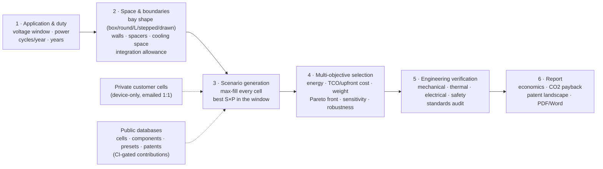

# battery-design

**Live app: <https://morshedvarzandeh.github.io/battery-design/>**

A 3D battery pack designer that runs entirely in the browser — a static page
with no build step and no server (deployed by GitHub Pages on every merge to
`main`; Three.js is vendored, so it also works offline).

Want to add a cell or component you found on the market? See
[CONTRIBUTING.md](CONTRIBUTING.md) — new entries integrate into the pickers,
optimizer, analysis and views automatically once they pass the CI data gate
(`tools/validate.mjs` + `tests/`).

Cell data is curated from public datasheets, several extracted via the
companion [battery-data](https://github.com/morshedvarzandeh/battery-data)
project's provenance-first datasheet pipeline.

## What it does

- **Design** — pick a cell (cylindrical 18650/21700/26650/32700/4680,
  prismatic LFP/LTO, NMC pouches, Na-ion), set series × parallel, choose grid
  or staggered-hex packing for cylinders and stacking for prismatic/pouch,
  and adjust cell spacers, wall thickness and busbar headroom. The 3D view
  colors cells by series group (following the actual serpentine welding
  order) or chemistry, shows the enclosure and series current path, and
  explodes for inspection.
- **From usage** — start from an application preset (e-bike, drone, ESS, EV,
  power tool, …) or raw requirements (voltage window, energy, continuous and
  peak power, charge rate, mass/size limits, temperature, cycle-life target).
  The optimizer enumerates cell × S × P candidates, sizes P by the binding
  constraint, checks feasibility, and ranks the survivors with reasons and
  warnings.
- **Fit box** — enumerate arrangements, orientations and layer counts to
  pack the current configuration into a target envelope, or just minimize
  volume.
- **Parts** — market-representative component catalogs per cell shape:
  busbars/interconnects (nickel strip, laser-welded copper, stamped aluminium,
  Tesla-style wire bonds, cell contact systems), cell spacers and holders
  (incl. aerogel/mica propagation barriers and pouch compression foam), gas
  vents (cell burst discs, PTFE breathers, PRVs, rupture panels), cooling
  systems (forced air, side and bottom cold plates, Tesla-style between-cell
  ribbon, immersion, PCM), thermal interface materials, and housings — each
  with class-typical properties and example suppliers (representative, not
  endorsements).
- **Analysis — four perspectives** — every design is audited from the
  Mechanical (component mass budget, compression, vibration, IP fit),
  Thermal (I²R heat, cooling adequacy ΔT, TIM interface), Electrical
  (busbar ampacity and loss, creepage/clearance per IEC 60664-1, isolation
  and leakage) and Safety (venting, propagation barriers, flammability, plus
  the full standards audit: UN 38.3 / IATA, ECE R100 / ISO 6469-3,
  IEC 62619 / 62133-2, UL family) perspectives, with the actual numbers in
  every finding.
- **Architecture** — how the pack is built up and switched: the module
  hierarchy (divisor enumeration of S, with cell-to-pack as a first-class
  path and parallel racks for MWh-scale systems — the tool models one pack
  and says how many you need), BMS topology (centralized / master-slave
  daisy chain / wireless, AFE IC and sense-wire counts, temperature-sensor
  ratio exposed), precharge sizing (τ = RC, ½CV², the main− → precharge →
  main+ closing sequence), contactors and fuse rules of thumb, DC-DC
  auxiliary supply, and the isolation floor with the governing standard as
  an explicit choice (the sources conflict at 500 vs 100 Ω/V — never
  averaged). Rendered as a one-line diagram that also embeds in the report.
- **Closest-possible framing** — when a target is out of reach in the given
  space, the tool never answers "infeasible": it presents the most possible
  solution close to the need, states the shortfall, and says how many
  bays/racks of the design would cover the target.

## The system workflow

The tool follows the same order a pack project runs in the market: the
customer's application and boundaries come first, and the design is derived
from them — never the other way around. The workflow bar in the app shows
where you are at every step.

## Space-first design, validated against real cars

The Fit tab works the way real projects do: the application fixes the
available space, and the tool extracts the most from it. The bay does not
have to be a rectangle — calculator-simple templates (box, round, L-shape,
stepped two-height) take typed dimensions, and a **Draw** mode lets you
sketch any plan outline on a 50 mm grid. The packer fills the true shape,
subtracting walls, spacer gaps, busbar headroom and the space the selected
cooling system consumes, then treats cell choice as a multi-objective
optimization (energy in the space vs cost vs mass, adjustable weights,
Pareto front flagged).

The model is benchmarked against production packs
(`tools/validate-vs-market.mjs`, runs in CI): with the calibrated 35%
integration allowance it reconstructs the Tesla Model 3 LR pack to within
1% (predicted 100S45P / 4,500 cells / 78.8 kWh vs the real 96S46P /
4,416 / 78.1 kWh), and shows the blade-cell cell-to-pack effect (96% of
geometric ideal vs ~64% for module-based packs).

## 2D-first workflow

The default working view is a cheap, dimensioned 2D drawing — top view (X·Y)
with cell layout, pitch/gap and outer dimensions, plus a side elevation (Z)
with layers and headroom. It redraws once per change with no WebGL and no
animation loop, so iteration is instant even for hundred-cell packs. The 3D
view is a **final render**: it is only instantiated when you press
"3D render", and its render loop pauses whenever you switch back to 2D.

## Honesty rules

- Every cell record carries `dataQuality` (`datasheet` vs `estimate`) and a
  `sourceNote` saying exactly what was estimated.
- Pack mass adds 8% for interconnects plus an aluminium-wall estimate, and
  the UI says so. DCIR is cells-only (interconnects excluded), labeled.
- Standards output is engineering guidance derived from public standards —
  not certification, and the page repeats that disclaimer.
- Hex (staggered) packing is only offered where it is geometrically real:
  upright cylinders. Lying cylinders and prismatic cells pack rectangularly.

## Architecture

| File | Role |
|---|---|
| `js/cells.js` | Cell library + chemistry data (self-contained, no imports) |
| `js/presets.js` | Application usage presets |
| `js/standards.js` | Standards rule engine over a computed design context |
| `js/components.js` | Component & materials catalog with supplier examples |
| `js/engineering.js` | Four-perspective analysis (mech/thermal/elec/safety) |
| `js/pack-engine.js` | Pure electrical + layout math (Z-up, mm) |
| `js/optimizer.js` | Requirement search + space fitting |
| `js/architecture.js` | Module partition, BMS topology, precharge/contactors/fuse/isolation |
| `js/viewer2d.js` | Default dimensioned 2D layout view (canvas, no WebGL) |
| `js/viewer3d.js` | Three.js instanced rendering — on-demand final render |
| `js/app.js` | UI state and wiring |

The data modules are import-free so they can be consumed by tooling (node
scripts, tests) without a browser.
