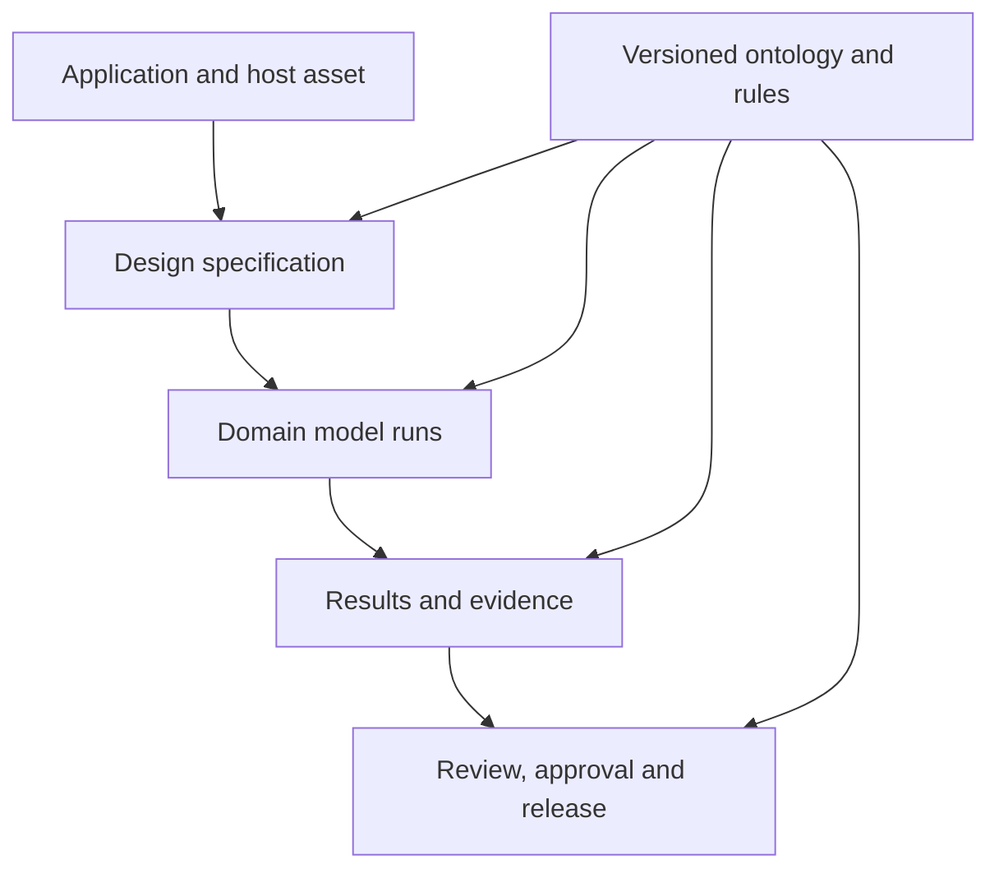

# Architecture-wide ontology

The battery-design ontology is the shared semantic contract for the complete
product. It governs requirements, host assets, battery designs, electrical,
thermal, safety, charging, geometry, missions, simulation, SIL/HIL, evidence,
approvals and reports. Charging is one peer domain; it does not own the
ontology.

The ontology is not a second physics engine. Deterministic JavaScript and Rust
modules calculate engineering results. The ontology declares what those
inputs, models, results and evidence records mean, connects them with typed
relations, and validates the graph before it can be exported or released.

## Contract boundaries

| Concern | Authority | Boundary |
|---|---|---|
| Classes, stable IRIs and relation domain/range | `js/ontology-schema.js` | One canonical vocabulary; unknown concepts fail closed. |
| Rule applicability and required facts | `js/ontology-schema.js`, `js/ontology-rules.js` | Data-only allowlisted grammar; no schema callbacks or silent mutation. |
| Engineering equations and time integration | Domain JavaScript modules and `rust-core/` | Numerical behavior remains independently testable and versioned. |
| Design/run/result/evidence graph | `js/ontology.js` | Content-addressed identity, explicit units, provenance and validation. |
| UI feature disclosure | `js/knowledge.js` | A projection of ontology capability applicability, not a competing graph. |
| Portable standards artifacts | `ontology/core.v1.ttl`, `context.v1.jsonld`, `shapes.v1.ttl` | Generated vocabulary and checked shapes must agree with the runtime schema. |
| Browser, desktop, API, MCP and report | Shared `designFromSpec()` result | Every surface consumes the same semantic root and checksum. |

## Safety and governance rules

Rules identify their authority, versioned evidence, applicability facts,
units, required facts and effect. Missing or dimensionally incompatible facts
produce an explicit review/blocking outcome. A rule never changes a design in
place and never invents a component selection.

The following shortcuts are prohibited:

- executable `condition` or `action` functions stored in the ontology;
- universal safety numbers copied from an example without topology and scope;
- averaging conflicting standards;
- promoting a model to `DigitalTwin` from a caller-supplied maturity label;
- releasing a design without passing evidence, exact-version approval and a
  release-authorized human;
- reconstructing a different semantic graph in a report when an authoritative
  graph was supplied.

## Vessel Twin application

`milliAmpere1` and `R/V Gunnerus` are separate `VesselModel` instances. Their
low-detail shapes are `EngineeringMassingModel` instances, while an identified
real vessel is a `PhysicalAsset`. A battery location is an
`InstallationStudy`, not proof of compartment fit. A `DigitalTwin` can be
created only when one vessel-bound model has calibration, independent
validation and representative content-addressed replay evidence tied to the
same physical asset.

## Validation and queries

`node tools/validate.mjs` checks the runtime registry, capability ownership,
rules, competency-question paths and byte-for-byte generated RDF/JSON-LD
artifacts. `tests/ontology.test.mjs` checks graph identities, relation
domain/range, run lineage, units, immutability, export integrity, twin maturity
and governance shapes. The CLI and MCP `query_ontology` surfaces can query the
complete product architecture or one finished design graph.

The portable graph excludes raw replay samples, private asset identifiers,
credentials and free-form evidence documents. It carries content digests and
governed bindings so traceability is preserved without leaking source data.
